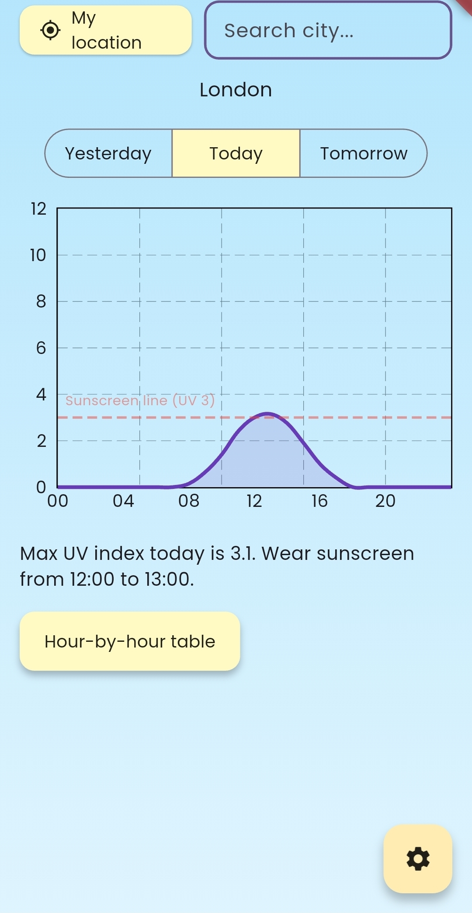

# SunCheck

A simple Flutter app that shows the UV index for your location so you know exactly when to wear sunscreen.



## Features

- Hourly UV index chart for yesterday, today, and tomorrow
- A clear message telling you the max UV and exactly which hours you need sunscreen
- Automatic location via GPS, or search for any city
- Hour-by-hour breakdown in a pop-up table
- Daily notification reminder (time is configurable in Settings)

## Built with

- [Flutter](https://flutter.dev)
- [Open-Meteo](https://open-meteo.com) — UV index and city search (free, no API key needed)
- [fl_chart](https://pub.dev/packages/fl_chart) — the chart
- [geolocator](https://pub.dev/packages/geolocator) — GPS location
- [flutter_local_notifications](https://pub.dev/packages/flutter_local_notifications) — daily reminders

## Setup

1. Install [Flutter](https://docs.flutter.dev/get-started/install) and make sure `flutter doctor` runs clean.
2. Clone this repo:
   ```
   git clone https://github.com/yourusername/uv-index-app.git
   cd uv-index-app
   ```
3. Get the dependencies:
   ```
   flutter pub get
   ```
4. Connect a device (or start an emulator) and run:
   ```
   flutter run
   ```

## Notes

- Location and notification settings are saved locally on your device.
- Notifications currently use Android's inexact scheduling, so they may arrive a few minutes after the set time.